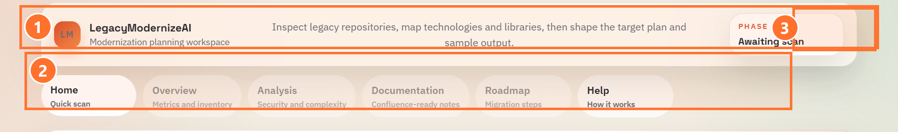
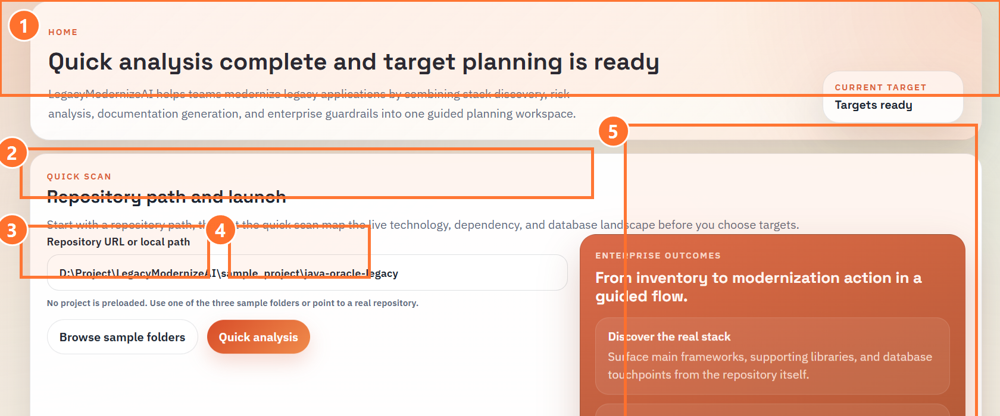
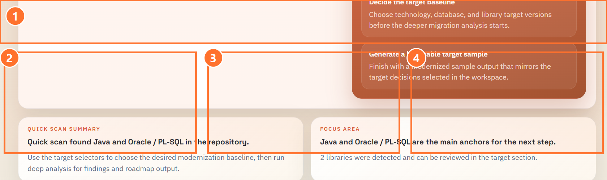
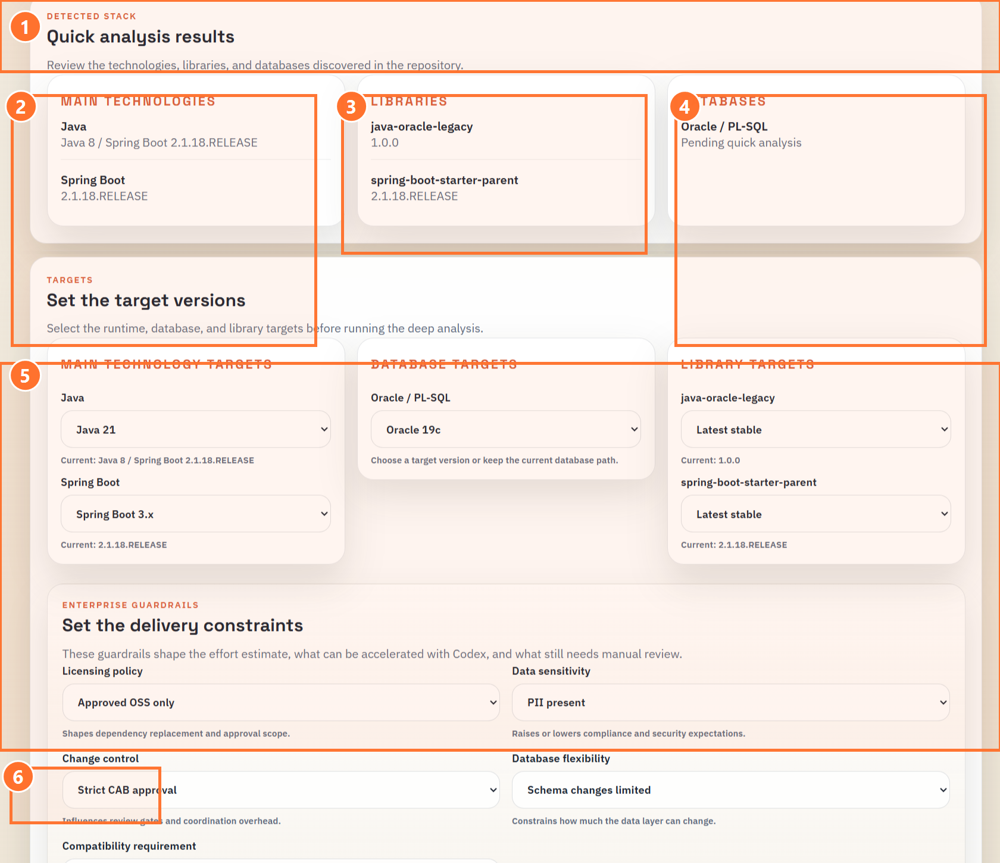
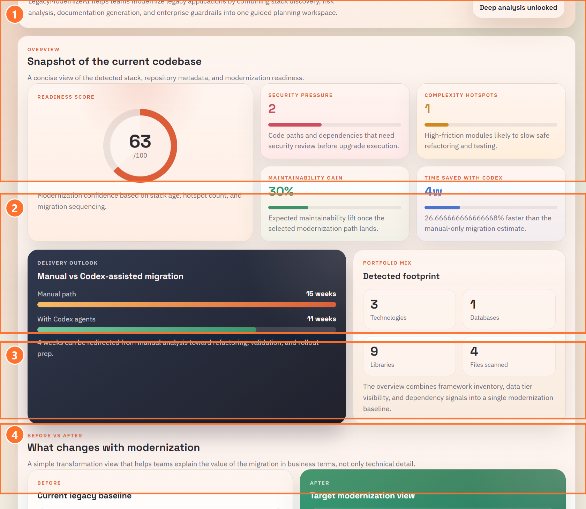
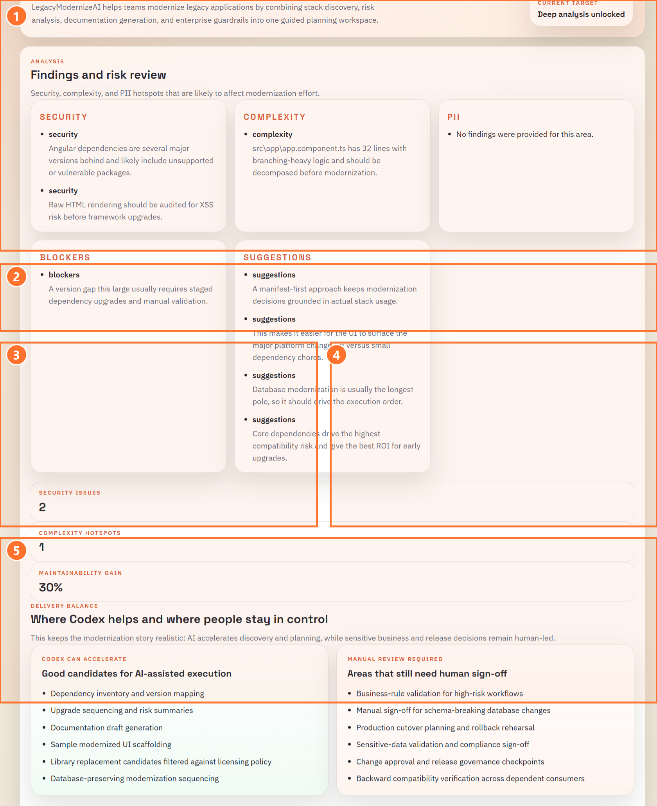
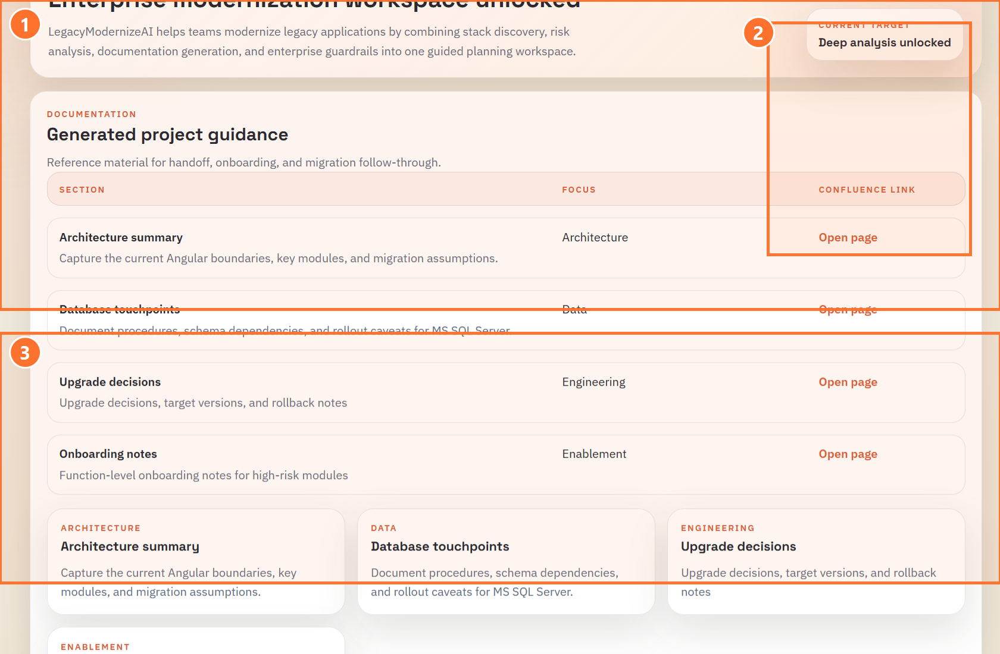
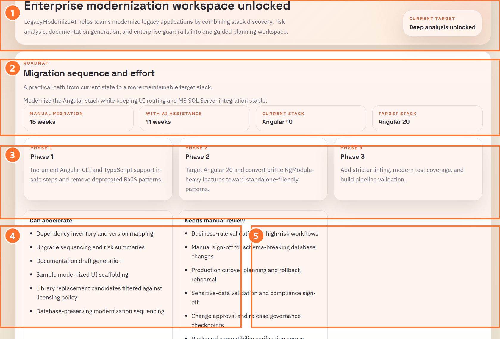
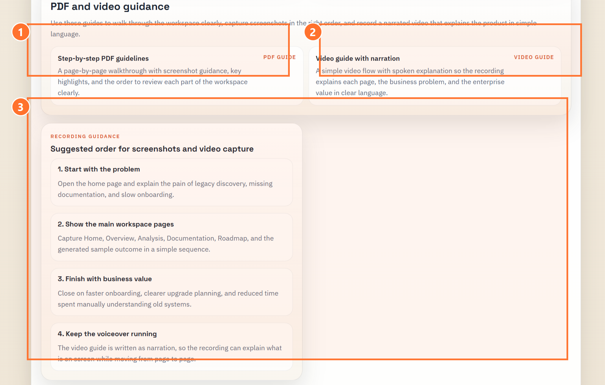

# LegacyModernizeAI Detailed Onboarding Guide

This guide is written as a descriptive, PDF-ready walkthrough for new users, delivery leads, and engineers who need to understand what each section of the workspace does before they start using the product.

It is designed to answer three questions clearly:

1. What is this section for?
2. What should the user click?
3. What should the user expect after that action?

The annotated screenshots below use numbered highlights so each region can be explained in plain language without forcing the reader to interpret a full screen on their own.

## 1. Product Purpose

LegacyModernizeAI helps teams inspect a legacy repository, detect its technical landscape, shape a realistic modernization path, and document the outcome in a way that supports onboarding and delivery planning.

It is useful when:
- a new engineer inherits an older Java, Angular, or React codebase
- the data layer includes Oracle, PL-SQL, or SQL Server assets
- delivery teams need a realistic estimate before committing to upgrades
- modernization choices must respect guardrails such as approvals, compatibility, or licensing constraints

The goal is not only to list versions. The goal is to turn uncertainty into a guided plan.

## 2. Navigation And Workspace Context

### 2.1 What the numbered highlights mean

**1. Product identity and workspace description**
- This introduces the product and explains the workspace in one sentence.
- A new user can read this first to understand that the product is meant to inspect repositories, map technologies, and shape a target plan.

**2. Menu row**
- This is the main navigation for the workspace.
- `Home` is where the scan begins.
- `Overview`, `Analysis`, `Documentation`, and `Roadmap` become the main review pages after deep analysis is complete.
- `Help` stays available as a permanent guide for new users.

**3. Phase badge**
- This shows the current step in the workflow.
- It helps the user understand whether the workspace is still waiting for a scan or already has enough information to move into planning.

### 2.2 What a new user should do here

1. Read the top description.
2. Note that `Home` is the entry point.
3. Use the badge as a quick status indicator while moving through the workflow.

## 3. Repository Path And Quick Analysis Controls

### 3.1 What the numbered highlights mean

**1. Home page hero area**
- This confirms the workspace is on the planning page.
- It also tells the user when the initial scan has completed and the target selection flow is ready.

**2. Repository path field**
- This is where the user points the application to a local repository or selected sample project.
- The scan uses this value as the source of truth for analysis.

**3. Browse sample folders button**
- This button helps a new user start immediately.
- Clicking it loads one of the built-in sample projects so the workflow can be demonstrated without preparing a real codebase first.

**4. Quick analysis button**
- This is the first action button that starts repository discovery.
- Clicking it launches the lightweight scan and temporarily disables the button while the progress state is active.

**5. Enterprise outcomes panel**
- This panel explains what the scan is intended to produce.
- It frames the product in business language: discover the real stack, decide the target baseline, and generate a believable sample outcome.

### 3.2 What the user should click

1. Paste a repository path or choose a sample folder.
2. Click `Quick analysis`.

### 3.3 What happens next

- the product reads the repository structure
- manifests, frameworks, libraries, and database hints are detected
- the lower planning sections become meaningful only after the quick scan returns results

## 4. Detected Stack Results

### 4.1 What the numbered highlights mean

**1. Result summary banner**
- This confirms the repository has been profiled successfully.
- It tells the user the scan has produced enough structure to move into target planning.

**2. Main technologies card**
- This card shows the primary runtime and framework signals found in the repository.
- It helps the user verify that the correct technology stack has been detected.

**3. Libraries card**
- This card shows supporting dependencies that may influence the upgrade path.
- It is useful for spotting older libraries that may need sequencing or manual review.

**4. Databases card**
- This card surfaces the detected database platform or procedural data-layer signals.
- It is important when the migration path depends on Oracle, PL-SQL, or SQL Server compatibility.

### 4.2 What a new user should do here

1. Confirm that the detected technologies are correct.
2. Check whether any libraries or database signals could affect scope.
3. Continue into target version planning below.

## 5. Target Versions And Delivery Constraints

### 5.1 What the numbered highlights mean

**1. Target planning section header**
- This marks the point where repository discovery becomes modernization planning.
- The selected values here are used by the deeper analysis.

**2. Main technology targets**
- These dropdowns capture the desired runtime and framework destination.
- A user chooses the future state for Java, Spring Boot, Angular, or React depending on the detected stack.

**3. Database target**
- This dropdown captures how the database layer should be treated.
- It allows the team to keep a current path or align the plan to a supported target database version.

**4. Library targets**
- These dropdowns hold supporting dependency targets.
- They are useful when the main framework upgrade still depends on companion library choices.

**5. Enterprise guardrails section**
- This section adds delivery constraints such as licensing policy, data sensitivity, change control, database flexibility, and compatibility requirements.
- These values shape the deeper estimate so the output is not generic.

**6. Deep analysis button**
- This is the main planning action.
- Clicking it unlocks the detailed pages and turns the quick scan into a full modernization assessment.

### 5.2 What the user should click

1. Choose the future runtime and framework versions.
2. Review the database target carefully if the system uses schema-heavy logic or stored procedures.
3. Set the guardrails that reflect the delivery reality.
4. Click `Deep analysis`.

### 5.3 What happens next

- the detailed workspace pages unlock
- effort, readiness, and maintainability metrics are calculated
- findings, documentation, and roadmap outputs become available

## 6. Overview Page

### 6.1 What the numbered highlights mean

**1. Snapshot metrics**
- This is the executive summary area.
- It includes readiness, issue counts, maintainability gain, and overall delivery balance.
- A new user should read this first because it gives the fastest understanding of the current state.

**2. Before and after comparison**
- This area compares the current legacy baseline with the proposed target view.
- It helps users see how the chosen modernization direction changes readiness, effort, and maintainability.

**3. Repository and scan summary**
- This strip keeps the practical context visible.
- It tells the reader which repository was analyzed, how many files were scanned, and when the analysis took place.

**4. Applied guardrails and inventory**
- This section explains which delivery constraints influenced the output and what technologies or databases were detected.
- It helps a new user understand why the recommendations may be more controlled than a generic upgrade suggestion.

### 6.2 What a new user should do here

1. Read the readiness score and issue counts first.
2. Compare the current baseline and target view.
3. Check the applied guardrails before interpreting the effort estimate.

## 7. Analysis Page

### 7.1 What the numbered highlights mean

**1. Findings cards**
- These cards summarize the main security, complexity, blocker, and suggestion themes.
- They help the user understand why the migration may be difficult.

**2. Severity counters**
- This strip summarizes the number of security issues, complexity hotspots, and expected maintainability lift.
- It gives a quick way to compare scan results across projects.

**3. Good candidates for AI-assisted execution**
- This section explains what can be accelerated safely.
- It often includes discovery, documentation, dependency mapping, and controlled scaffolding work.

**4. Areas that still need human sign-off**
- This section explains what still depends on people and approvals.
- It often includes business-rule validation, cutover planning, compatibility review, and release governance.

**5. Guardrail impact explanation**
- This section shows how the selected delivery constraints changed the assessment.
- It helps the user see that the plan is shaped by real-world constraints rather than a one-size-fits-all upgrade suggestion.

### 7.2 What a new user should do here

1. Read the findings cards from left to right.
2. Compare what can be accelerated and what remains manual.
3. Use the guardrail impact notes to explain why the plan is conservative or tightly controlled.

## 8. Documentation And Confluence View

### 8.1 What the numbered highlights mean

**1. Documentation table**
- This table groups the generated outputs into areas such as architecture, data, upgrade decisions, and onboarding notes.
- It is meant to support team handoff and knowledge capture.

**2. Confluence link actions**
- These actions take the user directly to the linked documentation pages.
- They make it easy to move from generated guidance into the shared knowledge space.

**3. Summary topic cards**
- These cards restate the document themes in a simpler visual format.
- A user can skim these cards before opening the linked pages in detail.

### 8.2 What a new user should do here

1. Review the table row names and descriptions.
2. Open the relevant Confluence page for the area they need.
3. Use onboarding notes and upgrade decisions as the first reading pack for new team members.

## 9. Roadmap And Effort View

### 9.1 What the numbered highlights mean

**1. Effort summary strip**
- This compares manual effort, AI-assisted effort, current stack, and target stack.
- It gives a quick planning summary before the user reads the phases.

**2. Phase cards**
- These cards break the migration into a staged sequence.
- They help the user avoid treating modernization as one large undifferentiated task.

**3. Delivery phase grouping**
- This region shows the structured order in which the work should progress.
- It gives the roadmap a clear beginning, middle, and hardening phase.

**4. Can accelerate**
- This section lists work that can move faster with AI support.
- It is useful for staffing and planning conversations.

**5. Needs manual review**
- This section lists the work that still needs human validation and release control.
- It keeps the roadmap credible by showing where automation should stop.

### 9.2 What a new user should do here

1. Read the effort summary first.
2. Review the phases in sequence.
3. Compare the acceleration opportunities with the manual-review responsibilities.

## 10. Help And Guidance View

### 10.1 What the numbered highlights mean

**1. Step-by-step PDF guidelines**
- This opens the written walkthrough.
- It is best for someone who wants a structured explanation with screenshots and annotations.

**2. Video guide with narration**
- This opens the spoken walkthrough script.
- It helps turn the workspace into a narrated explanation that can be recorded or presented consistently.

**3. Suggested order for screenshots and video capture**
- This section explains the recommended sequence for telling the product story.
- It helps a team record the product in a clean order without losing the core value message.

### 10.2 What a new user should do here

1. Open this page first if they want a plain-language orientation.
2. Use the PDF guide when they want a written walkthrough.
3. Use the video guide when they want a narration-friendly flow.

## 11. Recommended End-To-End Flow

The simplest onboarding flow is:

1. Start on `Home`.
2. Choose a repository path or sample folder.
3. Click `Quick analysis`.
4. Review the detected technologies, libraries, and databases.
5. Select target versions.
6. Apply delivery constraints.
7. Click `Deep analysis`.
8. Read `Overview` for the current-state summary.
9. Read `Analysis` for findings and manual-review areas.
10. Open `Documentation` for handoff notes and Confluence references.
11. Read `Roadmap` for phased delivery planning.
12. Use `Help` whenever someone needs a guided explanation of the workspace.

## 12. What A New User Should Remember

LegacyModernizeAI is most useful when it is treated as a guided modernization workspace rather than a single scan screen.

It helps answer:
- what technology is in the repository
- what target state makes sense
- what risks are present
- what can be accelerated safely
- what still needs human review
- what documentation should be shared to support onboarding and delivery

That is the main value of the product: it turns a hard-to-read legacy application into a visible, explainable modernization path.
